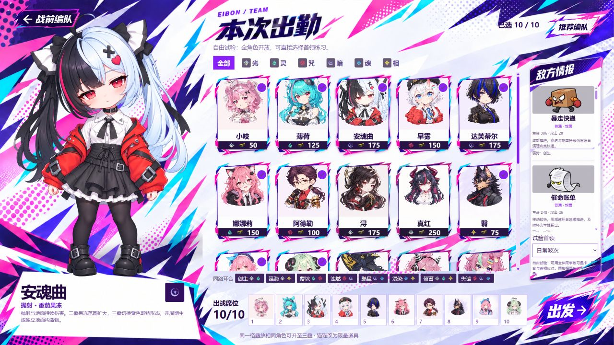
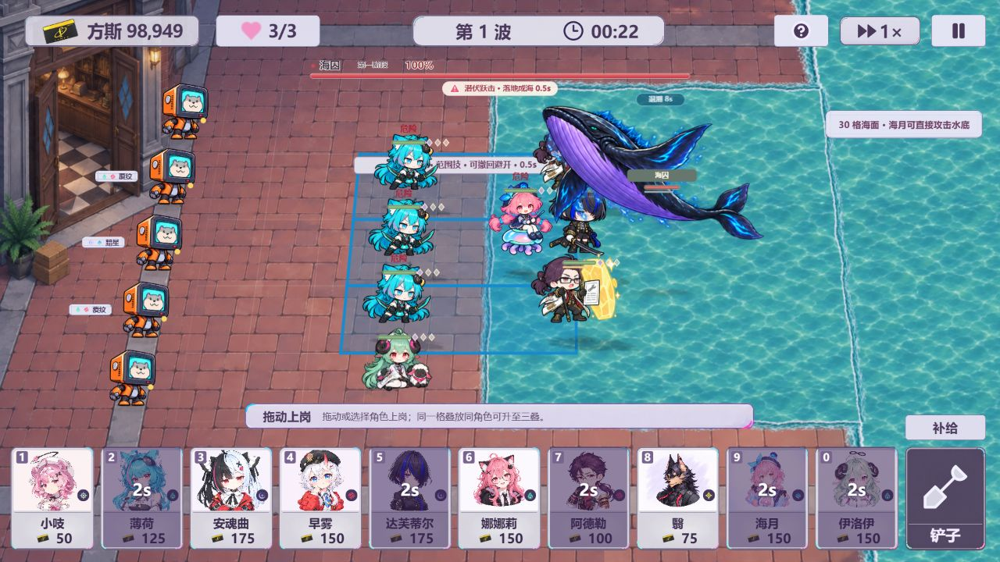

  
  <h1>异象大战伊波恩</h1>
  
<strong>v3.0 · 今天，也要守住这条街。</strong>

  
《异环》非官方同人塔防游戏

  
<a href="https://github.com/zhisandesu/eibon-tower-defense/releases/tag/v3.0.0">下载 3.0</a> · <a href="#游戏截图">游戏截图</a> · <a href="CHANGELOG.md">更新记录</a>

把熟悉的同事安排到街道上，用叠卡、属性环合与角色配合守住防线。飞行、重甲、护盾、幻象和海水各有应对方式；看准首领的预警，及时撤回与补位，也能靠操作渡过难关。

**22 位角色 · 33 个主线关卡 · 14 种首领 · 离线游玩**

## 下载与安装

| 平台 | 下载 | 使用方式 |
| --- | --- | --- |
| Windows 64 位 | [安装版 EXE](https://github.com/zhisandesu/eibon-tower-defense/releases/download/v3.0.0/Eibon-Tower-Defense-3.0.0-Windows-Setup.exe) | 下载后安装，桌面快捷方式启动 |
| Windows 64 位 | [免安装 ZIP](https://github.com/zhisandesu/eibon-tower-defense/releases/download/v3.0.0/Eibon-Tower-Defense-3.0.0-Windows-x64.zip) | 完整解压，运行“异象大战伊波恩.exe” |
| Android 9 及以上 | [安卓 APK](https://github.com/zhisandesu/eibon-tower-defense/releases/download/v3.0.0/Eibon-Tower-Defense-3.0.0-Android.apk) | 安装后横屏游玩，支持触屏拖放 |
| Wallpaper Engine | [壁纸项目 ZIP](https://github.com/zhisandesu/eibon-tower-defense/releases/download/v3.0.0/Eibon-Tower-Defense-3.0.0-WallpaperEngine.zip) | 完整解压，在壁纸编辑器导入 index.html，开启鼠标交互 |

下载包内置画面、音乐和动画，首次启动也不需要联网。Windows、安卓、网页和壁纸版分别在本机保存进度，存档不会跨平台同步。Windows 包暂未使用商业代码签名。安卓包已签名，但本次没有进行实体手机测试。

## 可以怎么玩

- **主线冒险**：从角色教学逐步进入精英与首领战，通关后招募同事。
- **无尽加班**：持续迎接新波次，后期加入双首领组合；战斗中可快速补位。
- **随机传送**：面对变化的战斗安排，尝试不同编队。
- **自由试验**：全角色开放，可直接选择首领练习机制和三叠搭配。

把角色卡拖到格子上部署，同一格叠放相同角色可升到三叠。点击铲子进入连续撤回模式，点击空格、其他区域或再次点击铲子收起。战斗顶部可调倍速、暂停；Windows 按 F11 切换全屏。切到后台会暂停战斗，回来后点击继续。

## 3.0 这次更新

- 提高首领普攻和技能连段频率，双首领预警保持错开。
- 重做海囚海水与跃击表现，半身潜游和全身跃起保持统一体型；海水持续 10 秒。
- 修复海啸首次扫过干地不造成伤害的问题：现在直接造成浪击，积水格伤害再提高 35%。
- 调整三叠数值、管家护盾和角色抗性，让针对性角色更有作用。
- 补全连携、净化、破甲、环境保护等说明和反馈；伊洛伊周围满血时不再播放治疗动画。
- 整理主线难度曲线、角色教学与精英配置；缩小战斗提示，简化首领血条。
- 铲子支持连续撤回，加入明显的选中状态、鼠标图标和音效。
- 新增 Windows 独立程序与安卓离线安装包，同步提供壁纸项目。

## 游戏截图

**主菜单**

**战前编队与角色说明**

**海囚战：海面与跃击范围示例**

## 壁纸版说明

[Steam 创意工坊作品](https://steamcommunity.com/sharedfiles/filedetails/?id=3811312531) 已同步更新到 3.0，可直接订阅或更新已有订阅。GitHub 的 ZIP 是完整、可导入的 3.0 壁纸项目。更新自己已有的工坊作品时，请保留原项目的工坊编号，在 Wallpaper Engine 编辑器中提交更新。GitHub 发布和 Steam 工坊发布各自独立。

## 开发与构建

运行、测试和三平台构建方法见 [BUILD.md](BUILD.md)。资源校验清单位于 runtime-manifest.json。

## 作品说明

本作是非官方、非商业同人创作，与《异环》官方无关联。角色与原作相关素材的权利属于相应权利人；部分视觉素材使用 AI 辅助制作。字体及运行框架的许可随文件保留，详见 [NOTICE.md](NOTICE.md)。
